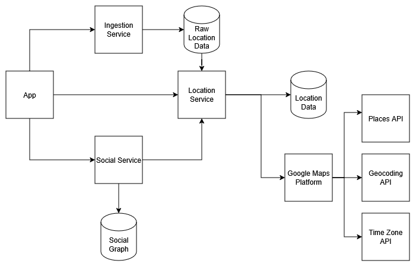

# Location Sharing App

This is a privacy-centered, location-sharing app that I'm building as part of the "Building Your Ideas" series on [my Twitch channel](https://www.twitch.tv/dewalddejager). The idea is based on this [Reddit thread](https://www.reddit.com/r/SomebodyMakeThis/comments/1qphdde/rule_based_location_share_app_for_phones_mainly/).

# Features
Here is a view of some of the features of the app (Not all are built yet but we are getting there):

1. Location tracking via app geolocation
2. Location sharing controls
	2. Exact location
	3. "Rough" location
	4. City
	5. Country
	6. Timezone
3. User profiles
	1. Usernames
	2. Phone number
4. Friends
	4. Invite by username
	5. Find by phone number
	6. Invite links
	7. Friends list
	8. Groups
5. Categories
	6. Family, Extended Family, Relatives, Close Friends, Friends, and Acquaintances
	7. Public/Other
	8. Can be added, removed, customized
6. Geographic zones
	7. Home, work, or any other area you choose
7. Map view
8. Authentication
	4. Username + password
	5. Login with social
9. Rule-based sharing
	2. Categories
	3. Geographic areas
		4. Share when I'm in this area
		5. Share only these areas
		6. Rules defined for zones always take priority over the general category rules.
	4. Time-based rules
	5. Individuals

# Tech Stack

- **App:** React Native cross-platform mobile app
- **Compute:** AWS Lambda functions running on Node.js 24
- **Language:** TypeScript
- **API:** API Gateway HTTP API with JWT authorizer
- **Auth:** Cognito User Pool (email/password + Google login)
- **Storage:** Amazon DynamoDB
- **IaC:** AWS SAM

# High-Level Architecture

There are 4 key components to this project:
1. The mobile app, which serves as the user interface to the system and is key in actually gathering the location data
2. The Ingestion Service, which is the service that location data is streamed to from devices
3. The Location Service, which stores the last known location for a user and evaluates the location-sharing rules to determine who can see a user's location and to what accuracy
4. The Social Service, which represents the social graph of which users follow each other and manage groups to simplify sharing rules

